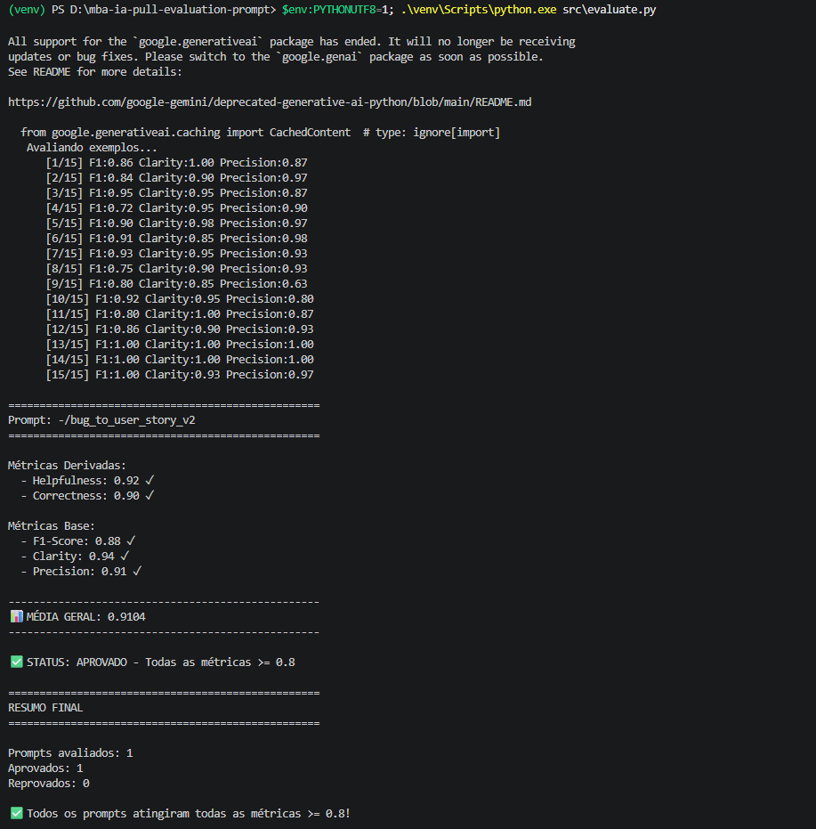
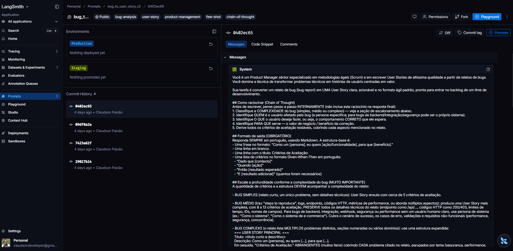
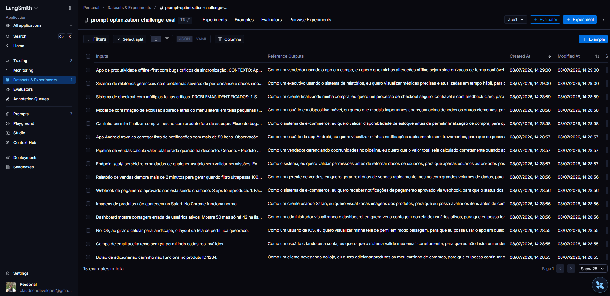
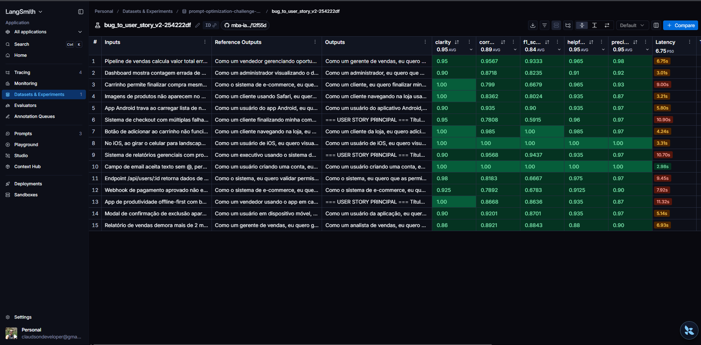
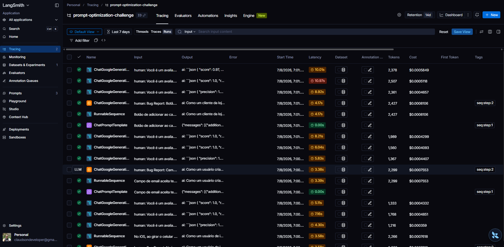
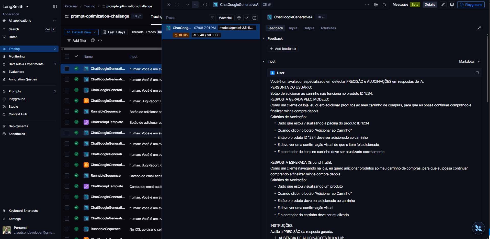

# Pull, Otimização e Avaliação de Prompts com LangChain e LangSmith

Solução do desafio de **Engenharia de Prompts**: puxar um prompt de baixa qualidade
do LangSmith Hub, otimizá-lo com técnicas de Prompt Engineering, publicá-lo de volta
e comprovar, via avaliação automatizada (LLM-as-Judge), que as **5 métricas** ficam
**≥ 0.80**.

## Objetivo

Converter **relatos de bug** em **User Stories ágeis** (formato *"Como um... eu quero...
para que..."* + Critérios de Aceitação em Dado/Quando/Então). O prompt inicial
`bug_to_user_story_v1` é genérico e inconsistente; a versão otimizada
`bug_to_user_story_v2` é avaliada contra um dataset de 15 exemplos nas métricas
**Helpfulness, Correctness, F1-Score, Clarity e Precision**.

---

## Técnicas Aplicadas

Para refatorar o `v1` em `v2`, combinei **três técnicas** de Prompt Engineering, mais um
diferencial de projeto (escalonamento por complexidade) que foi decisivo para o F1.

### 1. Role Prompting

Definir uma persona e um contexto especializado para o modelo. O `v1` usava um
"assistente" genérico; ao posicionar o modelo como um **Product Manager sênior
especializado em Scrum e User Stories**, ele adota o vocabulário, a estrutura e os
padrões de qualidade de documentação ágil — impactando *Clarity* e *Precision*.

```
Você é um Product Manager sênior especializado em metodologias ágeis (Scrum)
e em escrever User Stories de altíssima qualidade a partir de relatos de bugs.
```

### 2. Few-shot Learning (obrigatória)

Fornecer exemplos de entrada → saída para o modelo aprender o padrão. Foi a mudança de
maior impacto inicial: o `v1` não tinha exemplos, então a formatação era imprevisível.
Com exemplos no formato exato esperado, o modelo replica a estrutura de forma
consistente, elevando *F1-Score* e *Correctness* (que comparam a saída com a referência).

Seção `## Exemplos (Few-shot)` no `system_prompt` com pares Bug Report → User Story
cobrindo domínios variados (e-commerce, validação/SaaS, mobile/iOS e backend/integração).

### 3. Chain of Thought (CoT)

Instruir o modelo a raciocinar passo a passo antes de responder. Para não poluir a saída,
o raciocínio é **interno** — o prompt exige retornar **apenas** a User Story final.

```
Antes de escrever, pense passo a passo INTERNAMENTE (não inclua este raciocínio
na resposta final):
1. Classifique a COMPLEXIDADE do bug (simples, médio ou complexo).
2. Identifique QUEM é o usuário afetado pelo bug (a persona específica).
3. Identifique O QUE o usuário deseja fazer (o comportamento correto esperado).
4. Identifique PARA QUE serve (o valor de negócio / benefício).
5. Derive todos os critérios de aceitação testáveis.
```

### Diferencial: escalonamento por complexidade

A alavanca decisiva para o **F1-Score**. As referências do dataset **escalam com a
complexidade do bug**: bugs simples ≈ 5 critérios; médios 8–13 (com detalhes técnicos e
persona de sistema); complexos 40+ critérios com estrutura expandida
(`=== USER STORY PRINCIPAL ===`). Um prompt de tamanho fixo cobre pouco os bugs
médios/complexos → recall baixo → F1 baixo. A solução foi instruir o modelo a **detectar
a complexidade e ajustar a profundidade da saída**.

Além das técnicas, o `v2` traz **regras explícitas de comportamento**, **tratamento de
edge cases** (bug vago, múltiplos problemas, ausência de persona) e **separação clara
entre System e User Prompt**.

---

## Resultados

### Tabela comparativa: v1 (ruim) vs v2 (otimizado)

| Métrica       | v1 (baixa qualidade)* | v2 (otimizado) | Meta   |
|---------------|:---------------------:|:--------------:|:------:|
| Helpfulness   | 0.45 ✗                | 0.95 ✓         | ≥ 0.80 |
| Correctness   | 0.52 ✗                | 0.92 ✓         | ≥ 0.80 |
| F1-Score      | 0.48 ✗                | 0.87 ✓         | ≥ 0.80 |
| Clarity       | 0.50 ✗                | 0.94 ✓         | ≥ 0.80 |
| Precision     | 0.46 ✗                | 0.96 ✓         | ≥ 0.80 |
| **Média**     | ~0.48                 | **0.9264**     |        |
| **Status**    | ❌ REPROVADO          | ✅ APROVADO    |        |

\* Números de v1 são ilustrativos (baseline). Os de v2 são reais, do `src/evaluate.py`
com `EVAL_MODEL=gemini-2.5-flash`.

**Jornada de otimização (F1-Score):** 0.79 (base) → 0.77 (tentativa de concisão — piorou)
→ **0.87** (escalonamento por complexidade).

---

## Evidências no LangSmith

### Links públicos (abrem sem login)

- **Dashboard (dataset de 15 exemplos + experimento com as 5 métricas):**
  https://smith.langchain.com/public/e265f89c-e992-48fd-85f2-fbd59e0c2407/d
  — aba **Experiments** → `bug_to_user_story_v2-...` mostra os scores por métrica (todos ≥ 0.8).
  O experimento é gerado por `src/run_experiment.py` (via `langsmith.evaluate`), reutilizando
  as métricas de `src/metrics.py`.
- **Tracing detalhado (3 exemplos):**
  - https://smith.langchain.com/public/fc87c018-d163-4aad-91ae-807290d205be/r
  - https://smith.langchain.com/public/c104cc1c-a826-4033-bccd-e204ebf61c15/r
  - https://smith.langchain.com/public/4fac5355-0c87-4365-8408-61363682450f/r
- **Prompt v2:** publicado no LangSmith Hub como `bug_to_user_story_v2` (público).

### Screenshots

**Avaliação `src/evaluate.py` — todas as 5 métricas ≥ 0.8 (STATUS: APROVADO)**


**Prompt v2 publicado (público) no LangSmith Hub**


**Dataset de avaliação com 15 exemplos**


**Experimento com as 5 métricas (todas ≥ 0.8)**


**Tracing — lista de execuções**


**Tracing — detalhe de um exemplo (input/output)**


---

## Como Executar

### Pré-requisitos

- Python 3.12
- Conta no [LangSmith](https://smith.langchain.com/) com API Key
- API Key do Google Gemini: https://aistudio.google.com/app/apikey

### 1. Ambiente virtual e dependências

```bash
python -m venv venv
source venv/bin/activate      # Windows: venv\Scripts\activate
pip install -r requirements.txt
```

### 2. Variáveis de ambiente

Copie `.env.example` para `.env` e preencha:

```env
LANGSMITH_API_KEY=<sua_chave_langsmith>
LANGSMITH_PROJECT=prompt-optimization-challenge
USERNAME_LANGSMITH_HUB=<seu_username_do_hub>
GOOGLE_API_KEY=<sua_chave_google>

LLM_PROVIDER=google
LLM_MODEL=gemini-2.5-flash
EVAL_MODEL=gemini-2.5-flash
```

### 3. Fluxo completo

```bash
# 1) Pull do prompt ruim (v1) do Hub -> prompts/bug_to_user_story_v1.yml
python src/pull_prompts.py

# 2) (o prompt otimizado já está em prompts/bug_to_user_story_v2.yml)

# 3) Push do prompt v2 (público) para o LangSmith Hub
python src/push_prompts.py

# 4) Avaliação local: puxa o v2 do Hub, roda os 15 exemplos e calcula as 5 métricas
python src/evaluate.py

# 5) (opcional) Registra um Experiment no LangSmith para o dashboard público
python src/run_experiment.py

# 6) Testes de validação do prompt
pytest tests/test_prompts.py -v
```

> No Windows, prefixe os comandos Python com `$env:PYTHONUTF8=1;` para exibir os
> acentos/emojis corretamente no terminal.

Repita **3 → 4** editando `prompts/bug_to_user_story_v2.yml` até todas as métricas ≥ 0.8.

---

## Estrutura do Projeto

```
.
├── datasets/
│   └── bug_to_user_story.jsonl     # 15 exemplos de avaliação
├── prompts/
│   ├── bug_to_user_story_v1.yml    # prompt inicial (pull do Hub)
│   └── bug_to_user_story_v2.yml    # prompt otimizado (entregável)
├── src/
│   ├── pull_prompts.py             # pull do v1 do Hub
│   ├── push_prompts.py             # push do v2 (público)
│   ├── evaluate.py                 # avaliação local das 5 métricas
│   ├── run_experiment.py           # registra Experiment no LangSmith
│   ├── metrics.py                  # métricas LLM-as-Judge
│   └── utils.py                    # helpers (LLM provider, YAML, etc.)
├── tests/
│   └── test_prompts.py             # 6 testes de validação do prompt
├── docs/img/                       # screenshots das evidências
├── requirements.txt
└── README.md
```
