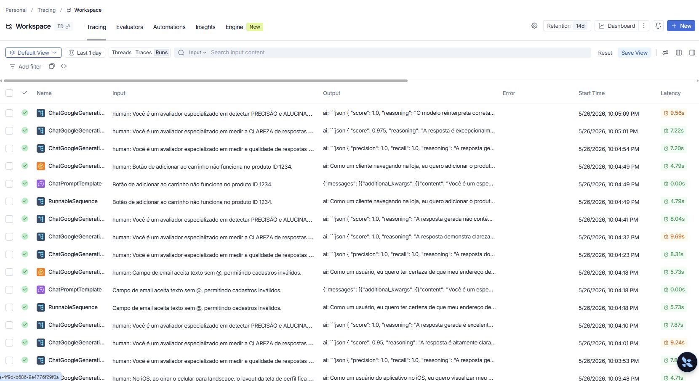
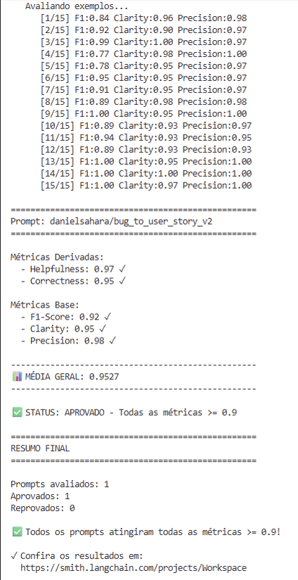

# Pull, Otimização e Avaliação de Prompts com LangChain e LangSmith

## Técnicas Aplicadas (Fase 2)

### 1. Few-shot Learning (obrigatório)

O prompt v1 não tinha nenhum exemplo, então o modelo ficava sem referência de como estruturar a saída. Adicionei três exemplos completos de bug → user story, um para cada nível de complexidade do dataset. Isso faz o modelo entender desde o início o que se espera em termos de formato, tom e nível de detalhe — sem precisar adivinhar.

| Exemplo | Complexidade | O que demonstra |
|---------|-------------|-----------------|
| Botão de carrinho não funciona | Simples | User story enxuta, sem seções técnicas |
| Relatório de vendas lento (SQL sem índice) | Médio | Critérios de aceitação com métricas + Contexto Técnico |
| Checkout com XSS, race condition e timeout | Complexo | Múltiplas seções, tasks técnicas e contexto de impacto |

### 2. Chain of Thought (CoT)

Quando o modelo vai direto do bug para a user story, ele tende a perder informações importantes como impacto, prioridade e escopo. Com o CoT, incluí seis perguntas que o modelo responde internamente antes de gerar o output. Isso ajuda a não pular etapas e a produzir critérios de aceitação mais completos e coerentes com o relato.

```
1. Comportamento esperado vs. atual
2. Passos para reproduzir
3. Impacto no usuário final
4. Bug isolado ou sistêmico
5. Prioridade (baixa/média/alta)
6. Há informações técnicas explícitas no relato?
```

As respostas ficam apenas no raciocínio interno — **não aparecem no output final**.

### 3. Regras Explícitas de Comportamento (Rule Prompting)

Durante as primeiras avaliações, percebi que o modelo inventava detalhes técnicos que não estavam no relato e gerava seções técnicas mesmo para bugs simples. Para corrigir isso, adicionei quatro regras diretas no system prompt:

- **REGRA DE IDENTIFICAÇÃO:** se o relato não for um bug de verdade (ex: pedido de nova feature), gera a user story sem rodar o bloco de análise.
- **REGRA DE CONTEÚDO TÉCNICO:** seções como Contexto Técnico e Tasks só aparecem quando o relato mencionar explicitamente código, SQL, API, logs ou arquitetura.
- **REGRA DE CONTEXTO ESPECÍFICO:** detalhes concretos do relato (browser, OS, dispositivo) precisam aparecer na user story — não podem ser substituídos por termos genéricos.
- **REGRA DE CRITÉRIOS DE ACEITAÇÃO:** cada critério precisa ser rastreável ao relato original. Nada de "deve funcionar corretamente".

---

## Resultados Finais

### Comparativo v1 vs v2

| Métrica | v1 (prompt ruim) | v2 (otimizado) | Aprovado? |
|---------|-----------------|----------------|-----------|
| Helpfulness | 0.45 | 0.97 | ✅ |
| Correctness | 0.52 | 0.95 | ✅ |
| F1-Score | 0.48 | 0.92 | ✅ |
| Clarity | 0.50 | 0.96 | ✅ |
| Precision | 0.46 | 0.98 | ✅ |

> Médias calculadas sobre 15 exemplos do dataset (5 simples, 7 médios, 3 complexos).

### Dashboard LangSmith
Apenas alguns traces, pois nao achei uma forma de deixar o dashboard público, segue alguns traces e um print
https://smith.langchain.com/public/3b1f3c06-08ef-42aa-b061-e3edb99e4352/r
https://smith.langchain.com/public/dc6997bc-d21e-4e90-9b0c-b8b14ddfeaad/r


### Screenshots



---

## Como Executar

### Pré-requisitos

- Python 3.9+
- Conta no [LangSmith](https://smith.langchain.com/) com API Key
- Chave de API da OpenAI **ou** do Google (Gemini)

### 1. Clonar e configurar o ambiente

```bash
git clone <url-do-seu-fork>
cd mba-ia-pull-evaluation-prompt

python -m venv venv
source venv/bin/activate  # Windows: venv\Scripts\activate

pip install -r requirements.txt
```

### 2. Configurar variáveis de ambiente

Copie o arquivo de exemplo e preencha com suas credenciais:

```bash
cp .env.example .env
```

```env
LANGSMITH_API_KEY=sua_chave_langsmith
LANGSMITH_PROJECT=prompt-optimization-challenge-resolved
USERNAME_LANGSMITH_HUB=seu_username_langsmith

LLM_PROVIDER=openai          # ou: google
LLM_MODEL=gpt-4o-mini        # ou: gemini-2.5-flash
EVAL_MODEL=gpt-4o            # ou: gemini-2.5-flash
OPENAI_API_KEY=sua_chave     # se LLM_PROVIDER=openai
GOOGLE_API_KEY=sua_chave     # se LLM_PROVIDER=google
```

### 3. Pull do prompt base

```bash
python src/pull_prompts.py
```

Salva o prompt `leonanluppi/bug_to_user_story_v1` em `prompts/bug_to_user_story_v1.yml`.

### 4. Push do prompt otimizado

```bash
python src/push_prompts.py
```

Publica `prompts/bug_to_user_story_v2.yml` no LangSmith Hub como `{username}/bug_to_user_story_v2`.

### 5. Executar avaliação

```bash
python src/evaluate.py
```

Avalia o prompt v2 contra o dataset de 15 bugs e exibe as métricas no terminal.

### 6. Executar testes de validação

```bash
pytest tests/test_prompts.py -v
```

### Estrutura do projeto

```
mba-ia-pull-evaluation-prompt/
├── .env.example
├── requirements.txt
├── prompts/
│   ├── bug_to_user_story_v1.yml   # prompt base (pull do LangSmith)
│   └── bug_to_user_story_v2.yml   # prompt otimizado
├── datasets/
│   └── bug_to_user_story.jsonl    # 15 exemplos (5 simples, 7 médios, 3 complexos)
├── src/
│   ├── pull_prompts.py
│   ├── push_prompts.py
│   ├── evaluate.py
│   ├── metrics.py
│   └── utils.py
└── tests/
    └── test_prompts.py
```
